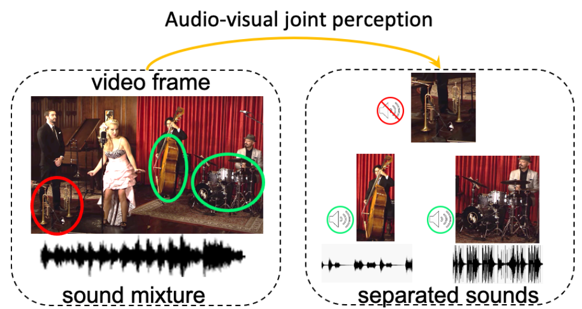

# CCoL
Pytorch implementation for CVPR21 "Cyclic Co-Learning of Sounding Object Visual Grounding and Sound Separation".

*This repository is under construction.



Unlike most of previous works, we assume that there are potential silent objects in videos during training. We perform sounding object-aware separation during training to alleviate the silent object issue. With a cyclic co-learning framework, our 
 model can simultaneously address sounding object visual grounding and audio-visual separation tasks.

## Environment
The code is developed under the following configurations.
- Hardware: 1-4 GPUs (change ```[--num_gpus NUM_GPUS]``` accordingly)
- Software: Ubuntu 16.04.3 LTS, ***CUDA>=8.0, Python>=3.5, PyTorch>=1.2***


## Training
1. Prepare video dataset.

    a. Download MUSIC dataset from: https://github.com/roudimit/MUSIC_dataset/blob/master/MUSIC_solo_videos.json
    
    b. Download videos.

2. Preprocess videos. You can do it in your own way as long as the index files are similar.

    a. Extract frames at 1fps and waveforms at 11025Hz from videos. We have following directory structure (please first ignore the detection results):
    ```
    data
    ├── audio
    |   ├── acoustic_guitar
    │   |   ├── M3dekVSwNjY.wav
    │   |   ├── ...
    │   ├── trumpet
    │   |   ├── STKXyBGSGyE.wav
    │   |   ├── ...
    │   ├── ...
    |
    └── frames
    |   ├── acoustic_guitar
    │   |   ├── M3dekVSwNjY.mp4
    │   |   |   ├── 000001.jpg
    │   |   |   ├── ...
    │   |   ├── ...
    │   ├── trumpet
    │   |   ├── STKXyBGSGyE.mp4
    │   |   |   ├── 000001.jpg
    │   |   |   ├── ...
    │   |   ├── ...
    │   ├── ...
    |
    └── detection_results
    |   ├── acoustic_guitar
    │   |   ├── M3dekVSwNjY.mp4.npy
    │   |   ├── ...
    │   ├── trumpet
    │   |   ├── STKXyBGSGyE.mp4.npy
    │   |   ├── ...
    │   ├── ...
    ```

    b. We created the index files ```train.csv```/```val.csv```/```test_sep.csv```. And the first two files are with the following format:
    ```
    /acoustic_guitar/M3dekVSwNjY.mp3, /acoustic_guitar/M3dekVSwNjY.mp4,1580
    /trumpet/STKXyBGSGyE.mp3, /trumpet/STKXyBGSGyE.mp4,493
    ```
    For each row, it stores the information: ```AUDIO_PATH,FRAMES_PATH,NUMBER_FRAMES```
    
    c. Detect objects in video frames. We used object detector trained by Ruohan used in his Cosep project (see [CoSep repo](https://github.com/rhgao/co-separation)). The detected objects for each video are stored in a .npy file. 
    
    

3. Train the grounding-only model for warming up
```bash
./scripts/train_grd.sh
```

4. Train the co-learning model 
```bash
./scripts/train_col.sh
```

3. Train the cyclic co-learning model
```bash
./scripts/train_ccol.sh
```

4. During training, visualizations are saved in HTML format under ```ckpt/MODEL_ID/visualization/```.

## Evaluation
1. Evaluate the trained separation model.
```bash
./scripts/eval_ccol.sh
```
2. Evaluate the sounding object-aware separation model on videos with silent objects.
```bash
./scripts/eval_ccol_silent.sh
```


## Reference
If you use the code from the project, please cite:
```bibtex
    @InProceedings{tian2021cyclic,
        title={Cyclic Co-Learning of Sounding Object Visual Grounding and Sound Separation},
        author={Tian, Yapeng and Hu, Di and Xu, Chenliang},
        booktitle = {CVPR},
        year = {2021}
    }
```

### Acknowledgements
We borrowed a lot of code from [SoP](https://github.com/hangzhaomit/Sound-of-Pixels) and used detector from Ruohan' [CoSep](https://github.com/rhgao/co-separation). We thank the authors for sharing their codes. If you use our codes, please also cite their nice works.

